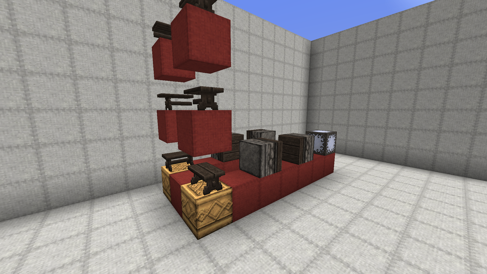

# GaldreenBlocksUnlimited

## Description
This Plugin adds the functionality to add easy to use custom blocks to your server.
In combination with a resourcepack this allows for the addition of extra details to builds in a survival friendly manner.
This plugin is specifically created for the german server Galdreen, but may also be useful for other servers.

## Features
- Customblocks, which can be configured based on orientation and can contain multiple cycles, which players can switch through.
    
    *Example of a CustomBlock. This Block is directional and has two cycles a player can cycle through using a tool (here the sword).
    This video uses the resourcepack by LordKeks, made for the Galdreen Server.*

- Abillity to make any block placeable on any block.
  
  *Using the /addplaceable command blocks can be defined as placeable under any circumstance. This allows for more flexibility with blocks like flowers.*

- Makes debugsticks work in survival (except for Customblocks and blacklisted blocks)

## Usage
- **AddPlaceable**
    This command must be executed with a block in hand. After execution this block is now placeable anywhere.
- **AddBlackListMaterial**
  The command pattern is ``/createGaldreenBlock <x-coord> <y-coord> <z-coord>``. The block that is that location will be added to a blacklist and can't be changed with the debugstick as a result. (Survival non-op only)
- **AddTool**
    This command defines the item in the hand of the executer as the tool used to switch between different block states in a cycle.
- **CreateGaldreenBlock**
    This command defines a new custom block or overwrites an old one. The command pattern is ``/createGaldreenBlock <x-coord> <y-coord> <z-coord> <Bool:use name> <name>``. During the execution the block that should be placed to create this custom  block should be in the main hand. The coordinate that needs to be entered is the one of the goal block of the first cycle.
  
  *Example of the definition of a custom block. Important to note: Blocks to place are always defined in positive x-direction and seperate cyles are defiend next to each other in positive z-direction. Blocks inside of a cycle are defined in positive y-direction. Between all of these different Blockstates there must be exactly one block. There should be no blocks surrounding the definition pattern. Diamond blocks are used as wildcards and match any placed block.
  This image uses the resourcepack by LordKeks, made for the Galdreen Server.*
- **GiveAllGaldreenBlocks**
   This command is executable by every player, that is in creative mode. It gives this player all of the custom blocks that were defined.
  
- **GiveGaldreenTool**
    This command is executable by every player, that is in creative mode. It gives this player the tool that has been defined.

## Note
- This plugin does not work for any situation. For example rails do not properly work as custom blocks, because they break do to not caught updates. Or on other hand buttons are one of the main blocks this plugin was written for, but not every situation is handled. If they are destroyed using a piston or water, they do not drop the custom block.
- This plugin needs WorldGuard and Towny, as it checks for both of these plugins, whether or not building is allowed.